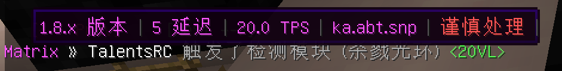

# ⚠️前言 ⚠️

> ## 现配置作者-CkaDebug
>
> 原作者(TalentsRC)弃坑，我通过留下来的遗产接手了这个项目
> 
> 后续的更新以及问题都是由我来处理
> 
> 如果你遇到配置問題請自行调试
> 
> （但不要**发布**或**出售**并声称是你的**原创**配置）
>
> ## 👇一些使用我配置并出售倒卖且声称是自己原创的窝囊废们👇
>
> [640597446](https://github.com/CkaDebug/Talents-anticheat-config/blob/main/.github/copySir/fuckyou_xiaoyousir.md)
> 
>
> ---
> 
> 本配置是 **免费制作** 
>
> 用来替换那些废物付费反作弊配置
> 
> **免费标签** 并不代表它很*垃圾*
> 
> 如果你 **看不起** 免费配置
> 
> 那就花钱去买与我 **相差无几** 付费反作弊配置
>
> 
> ---
> 如果你不知道怎么安装配置
>
> 动动脑子，这东西不难，替换文件的事情而已
> 
> QQ联系: 1957976089
>
> 邮箱联系我(Email) 1957976089@QQ.COM
>
> 放松，找我问问题不收你一分钱
>
> 但我不处理其他人的反作弊配置问题
>
> ---
> 另外的话
> 
> 您需要使用最新版Protocollib和Litebans来使用本配置
>
> 如果您不需要或者没有Litebans插件
>
> 请自行替换掉配置里的Litebans:kick指令

---

 

 
 ## 🛡人才反作弊配置🛡
 
### 尝试针对多种反作弊在各种玩法的服务器上进行 **优化** 的配置

### 出自2017-2024的作弊端用户之手

### 现由CraDebug（我）进行后续更新

#### **“别人在倚老卖老但我在以老带新，只为了给名利场刮点清风。”**

##### [更新日志](https://github.com/CkaDebug/Talents-anticheat-config/blob/main/.github/update-log.md)

##### 测试服地址：test.breeze.asia(1.8.9)

#### 感谢Dreeam-qwq大佬提供

---

✨特点✨
 
- 针对不同玩法服务器定制
- 近乎99%汉化的警报消息 
- 提升反作弊检测速度 
- 减少反作弊误判
- 独特的参数调配
- 完全免费

#### *歧视所有付费反作弊配置作者*

#### *你以为随便调些垃圾就能随便糊弄人*

#### *写不了反作弊只能卖参数赚钱你多少有点可悲*

---
 

###  **📷预览📷**
- 语言修改 *（改进反作弊的消息提示）*

---
 

 
### **⭐我正在调试的反作弊配置⭐**
最终，你仍然需要这些反作弊插件来使用配置

- [Matrix](https://matrix.rip) 
- [NocheatPlus](https://github.com/Updated-NoCheatPlus/NoCheatPlus)
- [NocheatPlus-Dreeam](https://github.com/Winds-Studio/NoCheatPlus)(性能优化版本)
- [GrimAC](https://grim.ac)
- [AntiAura](https://www.spigotmc.org/resources/antiaura-%C2%BB-reliable-cheat-detection-%C2%BB-anti-cheat-plugin.1368/update?update=16048)
- [Vulcan](https://www.spigotmc.org/resources/vulcan-anti-cheat-advanced-cheat-detection-1-7-1-19.83626/) *不推荐*
- [SoaromaSAC](https://www.spigotmc.org/resources/soaromasac-lightweight-cheat-detection-system-for-java-bedrock.87702/) 
- [Themis](https://www.spigotmc.org/resources/themis-anti-cheat-1-17-1-18-1-19-bedrock-support-paper-compatibility-free-optimized.90766/)
- [Hawk](https://github.com/HawkAnticheat/Hawk)
 ### 一些我会去配置但是我不保证它稳定性的反作弊配置
 （永远避免使用被作者抛弃的反作弊，因为它们只能检测远古特征且没有维护）
- [AAC](https://www.spigotmc.org/resources/aac-advanced-anti-cheat-hack-kill-aura-blocker.6442)
- [TakaAC](https://www.spigotmc.org/resources/taka-anticheat-takaac-cheap-and-reliable-solution.45167/) 
- [Horizon](https://www.spigotmc.org/resources/horizon-powerful-cheat-detection-in-new-era-1-8-1-12-1-13-1-14.65830/) 
- [KauriAC](https://www.spigotmc.org/resources/kauri-anticheat-best-in-class-performance-destroy-cheaters-1-7-10-1-18-1.53721/)
- [Spartan](https://www.spigotmc.org/resources/spartan-advanced-anti-cheat-cheat-detection-hack-blocker-1-7-1-19-2-10-summer-sale.25638) 💀[一些猛料](https://github.com/CkaDebug/Talents-anticheat-config/blob/main/.github/fucking-spartan.md)💀
- [AntiCheatReloaded](https://www.spigotmc.org/resources/anticheatreloaded.23799/)
- [Negativityv2](https://www.spigotmc.org/resources/negativity-v2-1-8-to-1-20-bungee-velocity-sponge-fabric-minestom.86874/) 不要使用，存在crash！
 
---

### ❓不知道如何选择反作弊❓
#### 翻阅我制作的[wiki](https://github.com/TalentsDX/Talents-anticheat-config/wiki)
#### 了解各个反作弊的特点
#### 以及我对它们的见解
---

### 🔧如何安装🔧

#### 1.把仓库下载到本地

####  2.替换掉原先反作弊的配置(yml)文件。

####  3.重新启动你的服务器。

#### 4.享受反作弊！

---

 💗我参考以及直接使用的配置💗
 
### 如果 *没有* 这些反作弊做参考，本项目也不会伟大，感谢这些配置作者！
 

- [Winds-anticheat-config](https://github.com/Winds-Studio/winds-anticheat-config)

- [Flex-AntiCheat](https://github.com/ItsMennyo/Flex-AntiCheat)

- [MatrixChecks](https://github.com/Encode42/MatrixChecks)

- TAC v1/v2/v3/v4 (R.I.P)

- Matrix7Checks （R.I.P）

---

